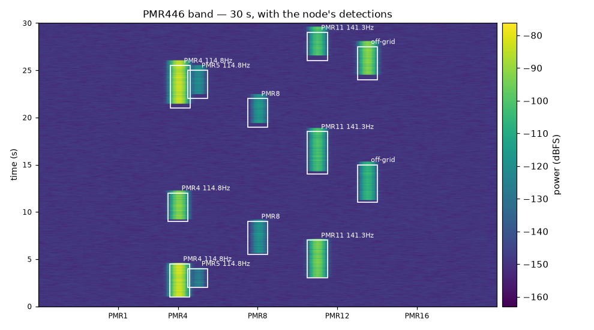

# ESM-446

**A passive Electronic Support Measures node for the PMR446 band.**



Surveys 445.1–447.1 MHz with a HackRF One, splits it into 160 channels with a polyphase
filter bank, detects emissions with a constant-false-alarm-rate detector, identifies them by
their sub-audible signalling, and turns the result into an order of battle and a
Cursor-on-Target feed a TAK client can draw.

The picture above is the whole system in one frame: energy arrives, the detector finds it,
the identification names it. It is regenerated by `make demo` on a machine with no radio
attached.

| | measured |
|---|---|
| Throughput | **0.30** CPU-s per signal second — 3.4× real time, against v0's **6.9** |
| Adjacent-channel rejection | **92.9 dB** measured on a modulated emitter |
| Sensitivity ripple across a bin | **6.02 dB** worst case, stated rather than hidden |
| False alarm rate | **0.90–1.12e-3** against 1e-3 on synthetic noise; **2.5e-7** on real receiver noise at a 1e-8 design point |
| Credible interval coverage | **95.3 %** achieved for the 95 % ring |
| Requirements | **41 MET**, 3 PARTIAL, 1 BLOCKED, traceability enforced by a test |
| Tests | **529**, 92 % coverage |

It records **signal metadata, never communication content** — see
[`docs/06_legal_ethics.md`](docs/06_legal_ethics.md). That is not a disclaimer bolted on
afterwards; it is why demodulated audio never leaves the function that identifies the tone.

## Sixty seconds

No SDR, no configuration, no arguments:

```bash
make install
make demo
```

That generates a scene, runs the node over it, scores the output against ground truth, and
writes `out/waterfall.png` and `out/dashboard.html` — the band picture above and the order of
battle as a page you can open. `make report` adds every figure in the V&V report.

## Running it on your own capture

The pipeline is identical for live capture and for replay, so everything below runs on a
clone with nothing plugged in.

```bash
poetry run pytest                    # 502 tests
poetry run esm446-bench              # throughput against the v0 baseline
poetry run esm446-node --file capture.cf32
```

Each detected emission is one JSON object on stdout:

```json
{"timestamp": 1786463892.27, "frequency_hz": 446106250.0, "pmr_channel": 9,
 "duration_s": 1.0007, "peak_power_dbfs": -25.36, "snr_db": 62.63,
 "estimated_dbm": null, "calibrated": false, "ctcss_tone_hz": null,
 "classification": "UNKNOWN", "peak_deviation_hz": 749.77,
 "gains": {"lna_db": 32.0, "vga_db": 20.0, "amp_enabled": false}}
```

Note `estimated_dbm: null`. Absolute power is reported only where a calibration exists for
that exact receiver gain configuration and level range. An uncalibrated estimate that looks
like a measurement is worse than no estimate.

## Order of battle

Detections are not intelligence. Store them and aggregate, and the band acquires a shape:

```bash
poetry run esm446-node --file capture.cs8 --format cs8 --store emissions.db
poetry run esm446-eob emissions.db
```

```
12 detections over 27.2 minutes, 8 of them by-products of a stronger emission
12.0 s of carrier, band load 0.7%

Emitters, busiest first:
  label                  n  airtime   duty  median  dev Hz    ±Hz
  PMR8/114.8Hz           2     7.9s   0.5%    3.9s    1338     26  (>= 1)
  PMR3/141.3Hz           1     3.7s      -    3.7s    1100      0  (>= 1)
  446.06670/no-tone      1     0.4s      -    0.4s    9848      0  (>= 1)

By-products, attributed rather than counted as emitters:
   446.13199 MHz    +38.2 kHz   -22.2 dBc  SPLATTER of PMR8/114.8Hz
   446.05573 MHz    -38.0 kHz   -22.8 dBc  SPLATTER of PMR8/114.8Hz
   446.15609 MHz    +62.3 kHz   -25.1 dBc  INTERMOD3 of PMR8/114.8Hz
   445.96892 MHz    -62.4 kHz   -22.0 dBc  INTERMOD3 of PMR3/141.3Hz
   ...

Emitter counts marked (>= 1) are lower bounds: none of that group's emissions
overlap in time, and a recording cannot separate one radio taking turns from
several sharing a channel and a tone.
```

That comes from two handsets and twelve detections. Three things in it are the system
declining to overstate what it knows.

**Every count is a lower bound.** Two emitters that never transmit at the same time cannot be
distinguished from one emitter that paused; no feature engineering escapes that, because the
evidence does not exist in the recording. A profile drops the marker only when two of its own
emissions overlap in time, which is the one observation that forces a second transmitter.

**By-products are attributed, not deleted.** A transmitter puts energy on other channels: its
own splatter, and its intermodulation with any other carrier on air. Those detections are
real, and each is identified by the arithmetic it obeys — a pair symmetric about one carrier,
or a product of two at 2·f₁−f₂, both holding to a few hundred hertz on the recordings. They
are attached to the emitter that produced them rather than counted as emitters, which is the
difference between reporting eleven and reporting three. Deleting them instead would discard
the only measurement this system makes of the transmitter's spectral purity — which turned
out to be a negative result worth keeping: see [`docs/04_link_budget.md`](docs/04_link_budget.md).

**What nothing explains stays an emission.** The third line is a 0.36 s detection at 2.9 dB
SNR with no symmetric partner and no relation to either carrier. It is probably splatter too.
It is not called splatter, because the arithmetic does not say so.

## Sensor to C2

Emissions are published as Cursor-on-Target, so a TAK client draws them. Transport is chosen
by configuration — UDP, TCP, TLS, or a TLS server for iTAK to dial into — and the message is
built once, so the wire cannot change what a consumer sees.

```bash
poetry run esm446-node --file capture.cs8 --format cs8 --cot udp://192.168.1.20:4242
```

```xml
<event version="2.0" uid="ESM446.PMR8.114.8" type="a-f-G" how="m-c" ...>
  <point lat="40.4168000" lon="-3.7038000" hae="0.0" ce="9999999.0" le="9999999.0"/>
  ...
```

**`ce="9999999.0"` is the interesting part.** A single omnidirectional antenna measures range,
not bearing, so there is no emitter position to send. CoT already has the right field: the
point is the *receiver's*, and `ce` is the radius the emitter lies within — which renders as
an accuracy circle rather than a confident pin. With no power calibration there is not even a
radius, so `ce` carries CoT's sentinel for unknown. A default of `0` would have drawn a
pinpoint fix on the receiver: precise, and wrong.

The interface is specified in [`docs/03_icd_cot.md`](docs/03_icd_cot.md) — messages, units,
cadence, staleness, behaviour on loss, and a section on what a consumer must **not** conclude
from a track. Every claim in it is tied to a test.

## Engineering documentation

| Document | What it is |
|---|---|
| [`01_requirements.md`](docs/01_requirements.md) | 45 numbered requirements, each with a verification method and the test that verifies it |
| [`02_architecture.md`](docs/02_architecture.md) | Block diagram, data rates, timing budget, memory, failure modes |
| [`03_icd_cot.md`](docs/03_icd_cot.md) | Interface control document for the CoT/TAK feed |
| [`04_link_budget.md`](docs/04_link_budget.md) | Predicted sensitivity and every hardware measurement taken |
| [`05_vv_report.md`](docs/05_vv_report.md) | Verification results, with figures regenerated by `esm446-vv` |
| [`06_legal_ethics.md`](docs/06_legal_ethics.md) | Legal basis, metadata-only policy, test-transmitter compliance |

**42 of 45 requirements MET, 2 PARTIAL, 1 BLOCKED** — and the traceability matrix is enforced
by `tests/test_requirements.py`, which fails the build if a requirement names a test that does
not exist, is blocked without naming the blocker, or claims a performance figure without
quoting it. It caught nine stale references the first time it ran.

## Why it was rebuilt

The v0 prototype, preserved verbatim in [`legacy/`](legacy/), produced output. It did not
work in the sense that matters, and the defects are measured rather than asserted:

| Defect | Measured | Now |
|---|---|---|
| Channeliser slower than real time | **6.9** CPU-s per signal second | **0.17** |
| Sample rate below the HackRF minimum | 800 kS/s requested, 2 MS/s minimum | rejected at startup |
| Receiver gains never applied | `8` passed as the channel index | quantised and read back |
| Audio sample-rate mismatch | 12121.2 Hz produced, 12000 assumed | derived, not restated |
| CTCSS detector loss from the above | **>12 dB** | exact-frequency Goertzel |
| Detection thresholds | two constants tuned on one afternoon | CFAR at a stated P<sub>fa</sub> |

Assembling the pipeline exposed four more that unit tests on the stages in isolation had
not, all fixed in [#9](https://github.com/alesan121/esm446/pull/9): a prototype cutoff that
passed half the adjacent channel (49.5 → 92.9 dB rejection), a CFAR noise estimate that made
the node 4.8× slower than real time, deviation readings dominated by keying transients, and
a benchmark that gated one stage while the pipeline regressed.

## Performance

Measured by `esm446-bench` on the development machine, at 2 MS/s over 160 channels:

| | CPU-s per signal second | Margin |
|---|---|---|
| v0 per-channel mixer and filter, 800 kS/s, 57 channels | 6.9 | **drops signal** |
| Polyphase filter bank | 0.18 | 5.5× real time |
| Full node pipeline | 0.30 | 3.4× real time |

The channeliser is roughly **40× faster than v0 normalised by signal duration**, while
covering 2.5× the bandwidth and 2.8× the channels.

Each figure is the **median of five runs**, which is not fussiness: a single wall-clock
measurement of this pipeline varies by up to 45 % with machine load, and the full node
ranged from 0.23 to 0.34 across the five. Quoting one run as *the* number would be false
precision. Reproduce them with `poetry run esm446-bench`; CI gates on the measurement rather
than on this table, which is what stops the two drifting apart.

## Design notes

**Why the receiver tunes to 446.09375 MHz.** That is PMR446 channel 8, an exact integer
number of 12.5 kHz steps from channel 1, so every channel lands precisely on a filter bank
bin with no half-bin offset and no resampling. The midpoint of the allocation, 446.1 MHz,
looks more reasonable and is half a bin off. The configuration refuses to start on a
misaligned centre frequency.

**Why OS-CFAR rather than CA-CFAR.** PMR446 channels are adjacent by construction. A strong
emitter inside the reference window inflates a cell-averaged noise estimate and masks its
weaker neighbour; an order statistic below the interferer's rank ignores it.

**Why two spectral paths.** The filter bank is optimised for selectivity, which costs a
1920-tap prototype. The wideband survey is a plain STFT at low duty cycle for occupancy and
off-plan emissions, at 0.009 CPU-s/s. Forcing one transform to do both means over-paying for
the wideband picture on every frame.

**What the CTCSS stage is not.** It is cooperative identification by a pre-shared sub-audible
key. There is no challenge, no response and no cryptography, so it is not IFF, and calling it
that would invite exactly the wrong question.

## Roadmap

| Phase | Content | State |
|---|---|---|
| 0 | Secure repository baseline | merged |
| 1 | DSP core, detection, identification, in-process pipeline | merged |
| 2 | Scenario simulator and recorded IQ test vectors | merged |
| 3 | Metadata sinks, Electronic Order of Battle, Monte-Carlo geolocation, CoT/TAK | merged |
| 4 | Two-emitter acceptance test merged; calibration blocked ([#41](https://github.com/alesan121/esm446/issues/41)) | partial |
| 5 | Systems-engineering documentation and V&V report | merged |
| 6 | Packaging: hardware-free demo, dashboard and results | merged |

## License

MIT — see [`LICENSE`](LICENSE).
