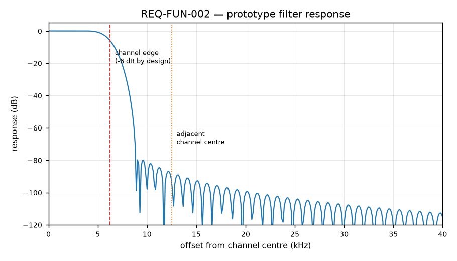
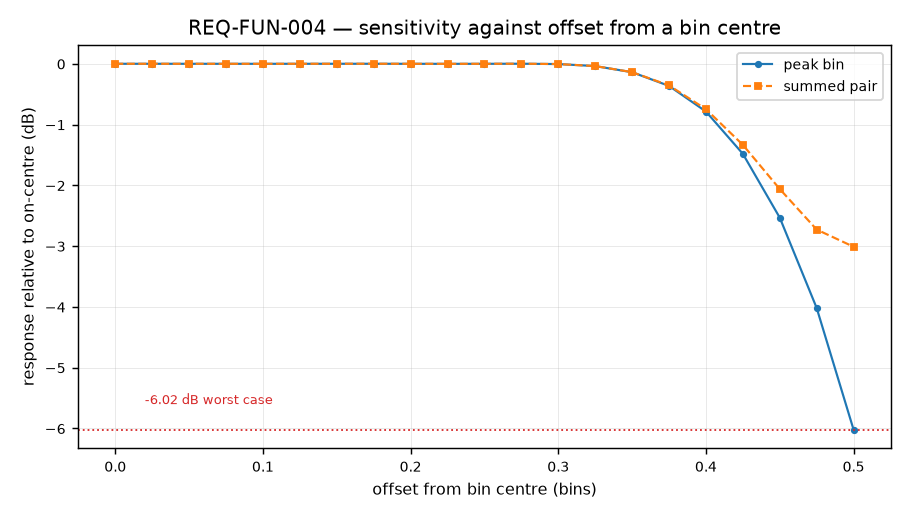
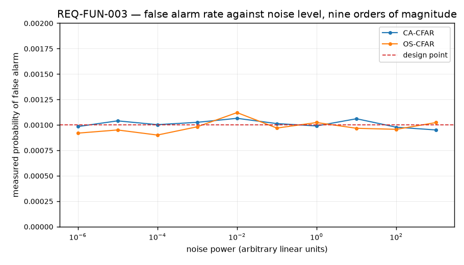
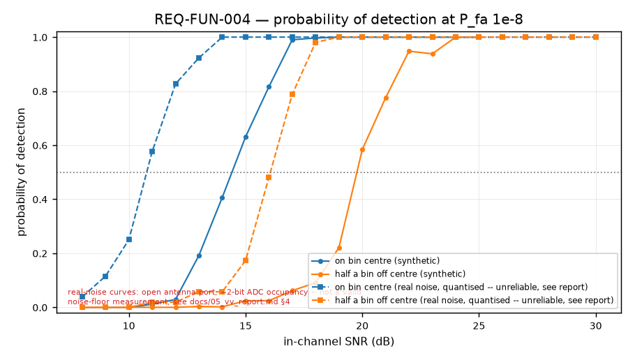
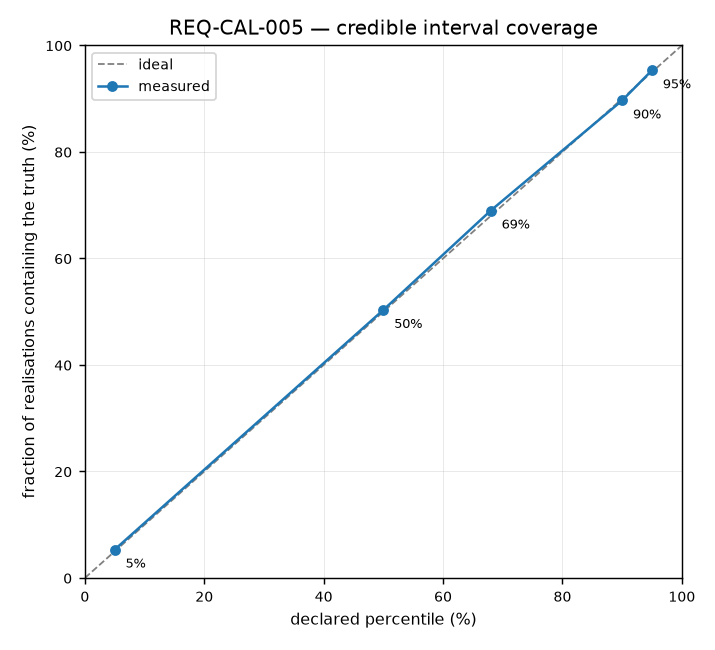
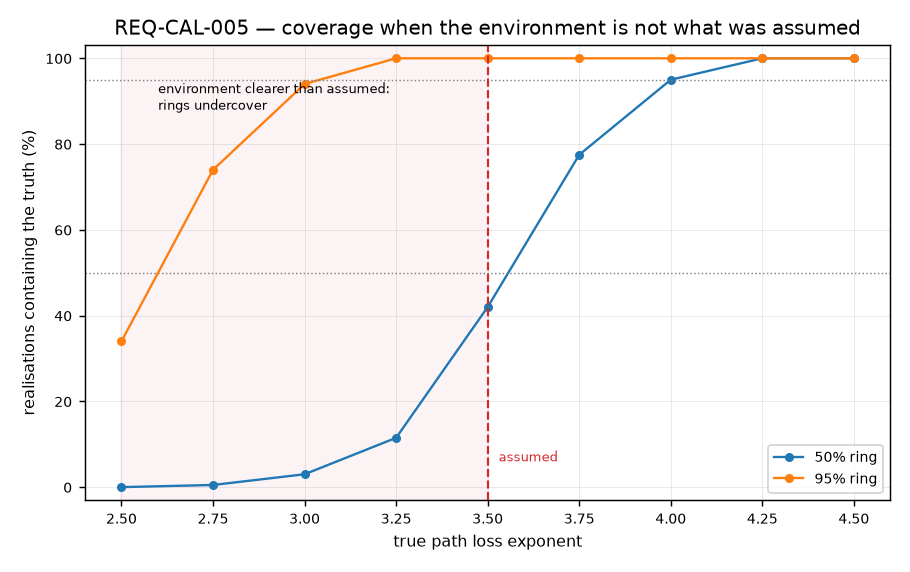
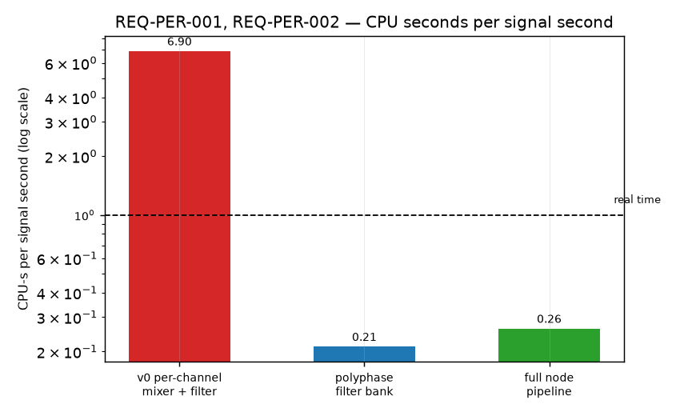

# Verification and validation report — ESM-446

**Document:** VV-ESM446
**Version:** 1.0
**Configuration under test:** 2 MS/s, 160 channels of 12.5 kHz, OS-CFAR at P<sub>fa</sub> 1e-8

Every requirement in [`01_requirements.md`](01_requirements.md), what verifies it, and what
the verification measured. Every figure below is regenerated from the system itself by

```bash
poetry run esm446-vv
```

which runs the real channeliser, detector and estimator and writes the underlying numbers to
`figures/results.json`. Nothing here is drawn by hand, and the report's tables and its plots
are read from the same file so they cannot disagree.

**Summary:** 45 requirements. **41 MET**, **3 PARTIAL**, **1 BLOCKED**. The blocker is a
calibrated power source; every consequence of not having one is traced below rather than
absorbed.

---

## 1. Verification methods

| Method | Meaning | Used for |
|---|---|---|
| **T** — Test | Executed against the implementation, pass/fail | 44 requirements — every one not blocked |
| **A** — Analysis | Derived, and cross-checked against an independent implementation in `matlab/` | link budget, channel plan, threshold factors |
| **I** — Inspection | Established by reading the code, where the property is structural | audio containment, bind address |
| **D** — Demonstration | Shown end to end on a clean checkout | replay pipeline |

`tests/test_requirements.py` enforces the matrix: a requirement with no verifying test, or
naming one that does not exist, fails the build. The traceability below is therefore a build
artefact rather than a document somebody maintains by hand.

---

## 2. Channelisation



| Requirement | Result |
|---|---|
| REQ-FUN-001 — channels on the 12.5 kHz raster | **MET.** Bin mapping agrees with the independent Octave derivation in `matlab/channel_plan.m` |
| REQ-FUN-002 — ≥60 dB adjacent-channel rejection | **MET — 92.2 dB measured on a modulated emitter (`channelizer.adjacent_channel_rejection_modulated`); 94.1 dB from the prototype's response alone** |

The rejection figure has history worth keeping. An earlier revision placed the prototype's
−6 dB point midway between the channel edge and the alias limit, reasoning that this "used"
the available transition band. It does — by passing the inner half of the adjacent channel.
Measured on a modulated emitter, rejection was **49.5 dB**. Moving the cutoff back to the
channel edge took it to **92.9 dB** at no CPU cost, and a strong emitter stopped producing
spurious detections in both neighbouring bins. A channeliser fault that looks exactly like a
detector fault.

That 92.9 dB was itself a snapshot, not a constant: the same test, unchanged, now measures
**92.2 dB** (`channelizer.adjacent_channel_rejection_modulated`) — no change to the cutoff
formula or the filter parameters in between, so the 0.7 dB drift is most plausibly the numpy/
scipy toolchain, not a code regression. Comfortably clear of both the 85 dB test threshold
and the 60 dB requirement either way, but it is exactly the shape of drift T1 exists to catch
before a hand-transcribed copy of it goes stale somewhere nobody is looking.

---

## 3. Sensitivity against offset from a bin centre



| Requirement | Result |
|---|---|
| REQ-FUN-004 — state the penalty for an off-centre emitter | **MET — measured −6.02 dB worst case** |

Flat to within a hundredth of a decibel across 60 % of the bin, then a cliff. This is not the
gentle sag of a windowed FFT's scalloping loss; it is the prototype's transition band, and
the worst case is the same −6 dB point that buys the 94 dB rejection above. **The two numbers
are the same design decision seen from either side.**

The summed-pair curve shows why the obvious fix returns less than it appears to: the split
energy does come back, 6.02 dB becoming 3.01 dB in raw response, but the sum is **incoherent**
(power, not phase-corrected amplitude — `paired_power = power + np.roll(power, -1)` in
`esm446/core/detector.py`), so the noise in the second bin comes back with it in the same
proportion. The measured detection gain at the worst offset is **1.25 dB**, not 3 dB, costing
0.25–0.38 dB everywhere else for splitting the false-alarm budget across two tests — and
enabling it made the recorded captures worse, breaking a real attribution. It ships
**implemented, verified, and off** — see
[`../esm446/core/detector.py`](../esm446/core/detector.py) and the closing note in §9.

**So the honest sensitivity figure for this system carries the full 6 dB ripple, not 3 dB:**
the mitigation is not in the shipped detection path, `detect_pairs` defaults to `False`, and
quoting the on-centre value alone would overstate the system by 6 dB for exactly the emitters
it is least likely to already know about.

**A second, smaller number lives in `esm446/core/detector.py`: 5.38 dB, not 6.02.** That is
not a typo or a disagreement -- it is a different quantity. 6.02 dB is the channeliser's
*power response* at the worst bin offset, a property of the filter alone, measured with
`figure_sensitivity_ripple` above. 5.38 dB is the *detection* penalty, the shift in SNR
needed for P<sub>d</sub> = 0.5 measured end-to-end through the CFAR detector (20.19 dB at the
worst offset against 14.81 dB on-centre). Detection is not linear in power, so the two need
not match, and empirically the detector's own noise-averaging softens the channeliser's raw
6.02 dB by about 0.6 dB. **6.02 dB is the specification figure** -- it bounds every offset
without needing a detector in the loop -- and 5.38 dB is the measured detection-cost figure
that confirms the spec is not optimistic.

---

## 4. Detection



| Requirement | Result |
|---|---|
| REQ-FUN-003 — P<sub>fa</sub> independent of noise level | **PARTIAL** — see below |
| REQ-PER-005 — holding the noise estimate does not move the rate | **MET** on synthetic noise, at update intervals 1, 64 and 256 |

On synthetic noise the design point is met exactly: 0.90e-3 to 1.12e-3 against a 1e-3 design,
across noise levels spanning **nine orders of magnitude**.

### On real noise, and why this is PARTIAL

The first ambient capture ever put through the node produced **eight emissions of twenty
seconds each on an empty band**, at signal-to-noise ratios of about zero decibels. Nothing was
transmitting.

The cause was not the threshold. It was the noise *estimate*: the whole estimate was held for
64 frames, and while the shape across bins really is static, the **level** moves with the
receiver on a far shorter timescale. When it drifted, every bin crossed at once — 44 % of all
crossings arrived in frames with ten or more bins crossing together, and the tracker's
quarter-second hangover then glued them into emissions.

Measured, with the DC bin excluded exactly as the node excludes it:

| capture | held level | level tracked per frame |
|---|---|---|
| Receiver only, antenna disconnected | **no crossing in 4.4 M cells**¹ | no crossing¹ |
| Real band, configured gain (VGA 20) | 3.6e-5 | **2.5e-7**² |
| Real band, high gain (VGA 40) | 3.3e-3 | **8.3e-6** |

¹ This vector's antenna port was open, not 50Ω-terminated, and at this gain the ADC occupies
only ~2 bits (§4 below has the full retraction). Zero crossings on a 5-level quantised signal
is closer to "almost nothing to cross" than to "correctly rejected" -- read as a passing
regression check, not as evidence the threshold is sound.

² Superseded by a much larger, antenna-connected, real-off-grid-emitter-confirmed run at the
same gain: **zero crossings over 2.88e10 cells**, a two-hour indoor capture -- see
`docs/04_link_budget.md`, "Measured: a real off-grid emitter, found indoors and confirmed by
retune". That result is not contaminated by the quantisation problem above (antenna
connected, real signal recovered from it), and is the better evidence for this operating
point. Kept here as the earlier measurement in the chain, not as the final word.

Separating the estimate into a held shape and a per-frame level costs **0.03 CPU-seconds per
signal second** and removes the broadband bursts entirely. The node now reports nothing at all
on the capture that produced eight phantoms, and detection of the two real emitters in the
recorded vectors is bit-for-bit unchanged at 74.7 % and 74.1 % of frames.

**It is PARTIAL because 2.5e-7 (superseded) and the later 2.88e10-cell result both fall short
of proving 1e-8** -- the second because absence of a crossing in one finite run bounds the
rate rather than measuring it. The residual is the environment: real receiver noise is
neither Gaussian nor stationary, and a threshold derived from an exponential assumption
cannot deliver an exponential tail probability against it. The design point is met where the
assumption holds, and the gap where it does not is now measured rather than assumed.

**One near miss worth recording.** The cheapest level statistic, a plain mean over all bins,
gave the best false alarm rate of anything tried — and raised the threshold by up to 26 dB
whenever a strong emitter was present, because one bin 40 dB above the floor moves the mean of
160 bins by a factor of sixty. On the recorded two-emitter capture it cut detection of the two
real carriers from 74 % of frames to 13 % and 7 %. No synthetic test would have caught it. It
was caught by running the candidate against the hardware vectors, which is why they exist.

This is the property v0's fixed thresholds could not have had. `MIN_POWER = 0.065` encoded one
antenna, one gain setting and one afternoon's noise floor; moved anywhere else it either went
deaf or fired constantly, and neither failure announces itself.



| | SNR for P<sub>d</sub> = 0.5, synthetic noise | SNR for P<sub>d</sub> = 0.5, real receiver noise |
|---|---|---|
| On a bin centre | **15.0 dB** in-channel | **11.0 dB** |
| Half a bin off centre | **20.0 dB** in-channel | **17.0 dB** |

Both at P<sub>fa</sub> = 1e-8 per cell per frame — which at 160 bins and a 25 kHz frame rate
is four million cells a second, so 1e-8 is roughly one false alarm every three hours rather
than the 400 a second a textbook 1e-4 would produce here.

### Why a real-noise curve exists at all

A P<sub>fa</sub> figure alone cannot tell a well-tuned detector from a deaf one — both report
zero false alarms. The two-hour indoor run above found zero crossings over 2.88e10 cells
against a 1e-8 design point, which by itself is also consistent with a threshold sitting
higher than intended: rule-of-three on zero events in that many trials bounds the *measured*
rate near 1e-10, two orders of magnitude under design, and a threshold that conservative would
also cost detection range. That is a real, correctly-reasoned concern, and P<sub>fa</sub>
cannot answer it. Only P<sub>d</sub> can.

So the same sweep behind the synthetic curve was repeated against
`tests/data/receiver_noise_lna32_vga20.cs8` — real captured receiver noise, antenna
disconnected, the same vector the zero-false-alarm result uses — with a synthetic tone added
on top at a controlled in-channel SNR, referenced against that window's own noise floor
measured from the same reference-cell span (channels 6–34) the CFAR threshold itself reads,
not a wideband time-domain RMS, which would be inflated by the local-oscillator spur at bin 0
and would understate every SNR in the sweep. 52 overlapping windows across the 1.1-second
vector, at each of 23 SNR points, two offsets.

The result came out the wrong way round: real receiver noise reached P<sub>d</sub> = 0.5 at a
*lower* SNR than synthetic noise, not a higher one — 11.0 dB against 15.0 dB on-centre, 17.0 dB
against 20.0 dB off-centre. That was checked before it was trusted, and it does not survive the
check.

**The vector is quantisation-limited, not thermal-noise-limited, and the 11.0/17.0 dB figures
are retracted.** `receiver_noise_lna32_vga20.cs8` was captured with the antenna **disconnected
and the SMA port open** — not terminated in 50 Ω. An open port reflects essentially all
incident energy rather than presenting a matched thermal source, and at LNA 32 / VGA 20 the
result barely registers on an 8-bit ADC: the raw samples occupy only **5 of 256 possible
codes** (range −2 to +2, roughly 2 bits), against 81 codes (roughly 6.3 bits) for
`ambient_noise_lna32_vga40.cs8`, the antenna-connected vector at higher gain. A
Kolmogorov–Smirnov test against a Gaussian rejects overwhelmingly for the open-port vector
(D = 0.522) and far less so for the antenna-connected one (D = 0.133). A signal quantised to
five discrete codes is not well described by *any* continuous noise model, exponential or
Gaussian, and OS-CFAR's order statistic over reference cells drawn from five discrete levels
behaves nothing like the theory it was derived from. That is almost certainly what the 4 dB
gap actually measured, not a property of this receiver's real noise being unusually favourable.

This is the same pattern this project has retracted twice already this session — a number
measured under one physical condition, stated as if it held in general — caught this time
before publication only because the result was implausible enough to interrogate rather than
because the measurement declared its own conditions. `tests/data/receiver_noise_lna32_vga20.cs8`
is being repurposed here for something its own committed description never claimed: it exists
to prove the detector reports nothing on receiver noise alone (`test_pure_receiver_noise_produces_no_false_alarms`,
still correct, still standing), not to characterise an amplitude distribution.

**What this leaves open.** Whether real thermal noise — antenna connected or port properly
terminated in 50 Ω — reaches P<sub>d</sub> = 0.5 above, below, or at the synthetic-noise SNR is
genuinely not known. `ambient_noise_lna32_vga40.cs8` is antenna-connected and far better
quantised (6.3 bits), but it was captured at VGA 40, not the shipped VGA 20, so it is not a
direct substitute. Repeating this sweep needs one of: a receiver-noise capture at the shipped
gain with the port terminated in 50 Ω (pending — see the note on `receiver_noise_lna32_vga20.cs8`'s
open-port condition), or a fresh capture at LNA 32 / VGA 20 with the antenna connected. Neither
has been done. The synthetic-noise curve (15.0 / 20.0 dB) is what this system's real-noise
detection performance should be checked against once one of those exists — not the 11.0 / 17.0
dB pair above, which is now documented as a measurement of quantisation, not of the receiver.

---

## 5. Identification

| Requirement | Result |
|---|---|
| REQ-FUN-005 — identify any of the 38 standard CTCSS tones | **MET.** Every tone identified through the full chain |
| REQ-FUN-006 — FRIEND only on the configured tone | **MET.** Verified on two real handsets carrying different codes |
| REQ-FUN-008 — measure peak deviation | **MET.** 1347 Hz measured on a real transmission, inside the 2.5 kHz ETSI narrowband limit |

The strongest result here came from the recorded two-emitter capture: the node identified the
second handset's **141.3 Hz** tone *before* the operator confirmed what it had been set to.
That is the only version of this test that counts, since anything else checks that the answer
was known in advance.

The generalised Goertzel is what makes it work. v0 used a fixed 12000-sample block against an
audio path that actually ran at 12121.2 Hz, so 114.8 Hz landed 1.15 bins off its own detector
— **more than 12 dB of loss**, appearing as spurious "unknown" classifications.

---

## 6. Attribution and order of battle

| Requirement | Result |
|---|---|
| REQ-FUN-011 — aggregate into an order of battle | **MET** |
| REQ-FUN-012 — counts are lower bounds without overlap | **MET** |
| REQ-FUN-013 — attribute by-products to their emitter | **MET — 11 emitters → 3 on the recorded captures** |
| REQ-FUN-014 — never delete an attributed detection | **MET** |

Two handsets produced twelve detections. Un-attributed, the order of battle reported eleven
emitters. Attribution by arithmetic relation — a pair symmetric about one carrier, or a
third-order product of two at 2·f₁−f₂ — reduced that to three, of which two are the radios
and one is a 0.36 s detection at 2.9 dB SNR that nothing explains and which is therefore not
claimed to be explained.

| relation | predicted | measured | error |
|---|---|---|---|
| splatter symmetry | — | — | **+211 Hz**, **−14 Hz** |
| 2·f₁−f₂ | 445.968 813 MHz | 445.968 917 MHz | **+104 Hz** |
| 2·f₂−f₁ | 446.156 190 MHz | 446.156 089 MHz | **−101 Hz** |

Against a 12.5 kHz channel spacing.

---

## 7. Range estimation



| Requirement | Result |
|---|---|
| REQ-FUN-016 — Monte Carlo uncertainty, empirical percentiles | **MET** |
| REQ-CAL-003 — refuse a range from uncalibrated power | **MET** |
| REQ-CAL-005 — intervals contain the truth at the declared rate | **PARTIAL** |

Measured over 300 realisations:

| declared | achieved |
|---|---|
| 5 % | 5.3 % |
| 50 % | 50.3 % |
| 68 % | 69.0 % |
| 90 % | 89.7 % |
| **95 %** | **95.3 %** |

**Why this is PARTIAL and not MET.** The realisations are drawn from the same prior the
estimator assumes. This verifies that the estimator inverts its own model correctly — a real
property, and one that is easy to get wrong — but it would look exactly this good if the prior
were wrong about the environment. Validating the prior needs measured distances against
measured power, which needs REQ-CAL-004, which is blocked.

### How badly it fails when the prior is wrong



Rather than leave that as a caveat, the exposure is measured: hold the estimator's assumptions
fixed and move the *true* path loss exponent away from the assumed 3.5.

| true exponent | 50 % ring | 95 % ring |
|---|---|---|
| 2.50 — near free space | 0 % | **34 %** |
| 2.75 | 0.5 % | 74 % |
| 3.00 | 3 % | 94 % |
| 3.50 — as assumed | 42 % | 100 % |
| 4.00 | 95 % | 100 % |
| 4.50 | 100 % | 100 % |

**The failure is asymmetric, and that is the useful part.** If the environment is more
obstructed than assumed, the estimator places the emitter further out than it is and the rings
still contain it — over-covering costs precision, not correctness. If the environment is
*clearer* than assumed, the emitter is further away than the model can reach and the ring
simply does not extend to it. In an open field, an exponent nearer 2.5, a ring claiming to
hold the emitter 95 % of the time holds it **about a third** of the time.

The operational consequence is a single sentence: **assume more obstruction than you think you
have, never less.** Three tests pin it, including one asserting that the conservative error is
the one in that direction, so the conclusion cannot be softened by editing this paragraph.

**What the estimate is worth.** For a signal at −95 dBm the median is 572 m and the 5–95 %
interval spans a factor of **42**. Taking each uncertainty alone:

| assumption | 5–95 % span it produces by itself |
|---|---|
| **path loss exponent, ±0.5** | **×25.0** |
| shadowing, 8 dB | ×5.6 |
| emitter EIRP, ±3 dB | ×1.9 |
| receiver calibration, ±2 dB | ×1.5 |

The exponent decides the answer and everything else is detail. Two consequences follow, and
both are the kind of thing a V&V report exists to surface: a range from one omnidirectional
sensor is nearly worthless without a locally measured exponent, and **calibrating the
receiver would improve it by almost nothing** — which is the opposite of what the v0
estimator's single shadowing sigma implied.

---

## 8. Interfaces and performance



| Requirement | Result |
|---|---|
| REQ-PER-001 — real time with ≥2× margin | **MET — 0.30 CPU-s/s median, 3.4× real time** |
| REQ-PER-002 — channeliser under 0.5 CPU-s/s | **MET — 0.18 median** |
| REQ-PER-003 — survey under 5 % of the channeliser | **MET — 0.009** |
| REQ-PER-004 — memory does not scale with capture length | **MET** |
| REQ-IF-001 — CoT validates against the schema | **MET** |
| REQ-IF-002 — the message does not depend on the transport | **MET.** Byte-identical over UDP, TCP and TLS |
| REQ-IF-004 — a failed publication does not interrupt capture | **MET** |
| REQ-IF-005/006 — range without bearing, unknown when uncalibrated | **MET** |
| REQ-IF-008/009 — records round-trip; older stores stay readable | **MET** |

v0 needed **6.9** CPU-seconds per signal second at a quarter of the bandwidth and a third of
the channels, so roughly **85 % of the incoming signal was never examined**.

Every throughput figure here is the **median of five runs**, and the range is published in
`figures/results.json` alongside it. One run of this pipeline varies by up to 45 % with
machine load — the full node ranged 0.23 to 0.34 across the five taken for this report — so a
single measurement quoted as *the* number is false precision. CI gates on the measurement
rather than on this table, which is what stops the two drifting apart.

---

## 9. What is not verified, and why

Three shortfalls, stated in full because a V&V report that lists only successes is an
advertisement.

**REQ-CAL-004 — absolute power. BLOCKED.** No calibrated source is available, so every
`estimated_dbm` the node produces is `null` and every range estimate is marked uncalibrated.
The consequences are traced rather than hidden: `ce` in the CoT message carries the unknown
sentinel, `estimate_from_report` returns `None`, and the link budget's predicted sensitivity
figures are labelled as computed from datasheet values for a device that has not been
characterised. See [#41](https://github.com/alesan121/esm446/issues/41).

**REQ-CAL-006 — frequency accuracy. PARTIAL, and the failure analysis is the result.**
Consistency between captures is verified. Absolute accuracy is **not established**: across
four cellular carriers spanning 806 to 1835 MHz the LTE-notch method fell between -0.17 and
-0.62 ppm, but the DVB-T band-edge method on the same receiver disagreed by several ppm, and
an independent third-party tool (`kal-hackrf`, against real GSM base stations) put the figure
at -36 to -38 ppm -- thirty times larger than either of this project's own methods. No single
number is quoted, because none of them agree with each other by more than their own stated
precision.

No tighter figure is quoted, and the reason is worth more than a number would have been. That
disagreement pattern is itself evidence for an unreliable clock reference
([#60](https://github.com/alesan121/esm446/issues/60)), not for a small, fixed crystal error
that different methods are each mismeasuring -- see §9 and `docs/04_link_budget.md`.

The estimator first shipped had a **14 % scale error**. It took the centroid of the power
deficit over a window fixed on the nominal frequency, and such a centroid contracts towards
the window centre as the notch moves away from it. It was found by closed-loop injection:
shifting a real capture by a known amount and re-measuring recovered 86 % of every shift, on
every capture tried. The unit tests did not catch it because their tolerance was 150 Hz on
shifts of a few hundred hertz -- wider than the error. The replacement estimates the notch's
axis of symmetry, which has unity gain by construction and measures 0.29 % on real captures,
and `test_the_measurement_has_unity_gain` now tests the *slope* across several shifts rather
than each point, because slope is the quantity a scale error corrupts. That test fails against
the estimator it replaced, which is the only evidence that a regression test is worth having.

A second defect: one capture had been taken with the receiver tuned onto the carrier, putting
its own local-oscillator spur inside the notch. It read -14 Hz where six other local
oscillators on the same carrier read -109 to -367 Hz, biasing towards zero -- the direction
that makes a receiver look better calibrated than it is. Captures tuned within 200 kHz of the
carrier are now refused.

With both fixed, the four references still disagree at chi2/dof = 30. Repeating one carrier at
a fixed local oscillator, ten captures over two minutes, shows why: the estimate wanders by up
to 0.14 ppm while nothing about the receiver changes. The notch is a gap in a live, loaded
signal, and the traffic on the subcarriers either side of it is what the symmetry estimate is
comparing. A stability screen -- a reference is usable only if its own repeats agree to better
than 0.05 ppm, which is a judgement about the reference and not about whether it agrees with
the others -- rejects three of the four. The survivor, 806.0 MHz, gives -0.343 +/- 0.009 ppm
and repeats to 11 Hz across three sessions, but one reference with nothing independent to
check it against is not a calibration. A GSM FCCH burst, an independent method with different
systematics, returned -1.65 ppm and that disagreement is unresolved.

Settling it needs a disciplined oscillator, which is the same instrument REQ-CAL-004 is
blocked on. The measurement is limited by the absence of a traceable reference, not by the
technique.

**An eight-hour unattended capture (2026-08-15/16) produced data of unverifiable
provenance, and the tooling that let that happen has been fixed.** The session's long-run
phase captured, processed and deleted each chunk in sequence, keeping only aggregate metrics
and one `mount.json` for the whole 8 hours. That meant two things could not be checked after
the fact, because the raw samples they would have been checked against no longer existed:
whether the antenna stayed connected for the full session, and whether anything about the
physical setup changed partway through it. Both are now fixed going forward -- an inline
ADC-occupancy/level accumulator runs in the same block-by-block pass the pipeline already
makes over each chunk (no second file read), and one sidecar is written per chunk instead of
one per session -- but neither fix can be applied retroactively to data that is already gone.
That session's results are recorded as unverified, not as valid.

A short gain sweep taken the same night (34 of 36 LNA x VGA points, raw IQ retained) surfaced
two things worth stating as open, not settled:

- *ADC occupancy is dominated by VGA, not by total gain.* Holding VGA fixed and varying LNA
  from 0 to 32 dB changes the occupied code count by at most one code at every VGA setting
  tried; holding LNA fixed and sweeping VGA changes it by more than an order of magnitude.
  **This is a hypothesis to falsify, not a finding to build on**: if the noise that fills the
  ADC is generated downstream of the LNA, an occupancy-based discriminator may not distinguish
  an antenna connected from a port left open at some gain settings, which would undercut the
  premise of using occupancy alone to screen a capture's provenance.

  **Partially falsified since, at LNA 32 / VGA 20/32/40/50, antenna vs. open port:** paired
  10 s captures at each gain point (antenna connected vs. port open, HackRF and cable
  untouched between the two) found clear separation from VGA 32 upward -- occupied codes 15
  vs. 9 (VGA 32), 36 vs. 18 (VGA 40), 99 vs. 55 (VGA 50) -- and no separation at all at VGA 20
  (6 vs. 5), which is the already-known quantisation floor. The premise holds from VGA 32
  upward; it does not hold at VGA 20. This does not yet use a proper 50 ohm termination
  (still on order) -- the "open port" condition here is a genuinely disconnected antenna, not
  a matched load, so it bounds the question but does not fully settle it.

  **Then a second measurement at VGA 40 found something more important than the separation
  itself.** A dispersion check -- 4 short captures each condition, same session, antenna
  untouched between repeats within a condition -- gave a clean result on its own terms:
  antenna 62-66 codes (mean 63.75, std 1.48), open port 18-19 codes (mean 18.50, std 0.50),
  a 43-code gap against roughly ±1.5 codes of scatter within each condition, about 29 standard
  deviations of separation. Taken alone that looks like a settled result.

  **It is not, because the antenna condition itself had already moved.** The earlier VGA 40
  comparison (previous paragraph, same gain, same antenna, hours earlier the same day) found
  36 occupied codes with the antenna connected. This session found 63.75. Same condition,
  same gain point, a 77 % change within one day. The dispersion just measured (±1.5 codes) is
  therefore **the dispersion *within one twenty-minute session*, not the dispersion of the
  "antenna connected" condition** -- four captures taken back to back share whatever the band's
  traffic was doing at that moment, which is exactly why they cluster tightly. The band's
  traffic level, not just the antenna/open-port distinction, is very plausibly what is moving
  the occupied-code count between the two sessions.

  **The consequence for any future threshold:** the case that actually decides a workable
  threshold is not the one measured today. It is "antenna connected, quiet band" -- overnight,
  low traffic -- and that floor has not been measured. If band traffic is what pushes
  occupancy from 36 to 64, the quiet-band floor could sit meaningfully lower than either
  figure, plausibly closer to the open-port range (18-19) than either antenna measurement
  suggests. **A threshold fixed from today's midday data risks false positives through every
  quiet overnight session** -- precisely the sessions the BIT exists to protect. No threshold
  is set from this data. The next overnight run should take a short reference capture at the
  same gain point at the start and end of the session specifically to measure this floor,
  rather than dedicating a separate session to it.

  Falsifying the remaining VGA 20 gap, and replacing the open-port proxy with a proper
  reference, both still need the 50 ohm termination that has not arrived yet.
- One point in that sweep, LNA 40 dB / VGA 30 dB, measured 42 occupied codes against 12-18 at
  the same VGA setting for every other LNA value -- a break in an otherwise smooth trend,
  timestamped at 21:18:28, immediately before two later points in the same sweep failed to
  capture at all (returncode 1) when the HackRF was disconnected. Plausible, not confirmed:
  the connection may already have been degrading before it failed outright. Recommended before
  trusting that point: re-capture it.

Separately, and not a signal-quality question: **the same session's long-run phase spent
roughly 25 % of its wall-clock time processing rather than capturing.** 90 chunks of a nominal
240 s each account for 6.0 hours of RF; the session ran 8.01 hours. The overhead is the
CFAR/channeliser pass over the previous chunk running to completion, serialised, before the
next capture opens -- measured directly from the session's own per-chunk timing, not
estimated. Noted as a future efficiency improvement (overlapping capture and processing would
recover most of it), not prioritised over the provenance gap above.

**Specific emitter identification — attempted, and it failed.** The ±37.5 kHz spurious pair
was the strongest candidate: discrete, repeatable, and a property of the transmitter rather
than of the path. Measured across a Baofeng UV-5RA and a Radtel RT-900 it sits between −33.4
and −34.7 dBc — a spread inside the measurement's own uncertainty. A feature taking the same
value on two independently designed radios identifies a family, not a unit. No requirement
was levied on it, and the order of battle groups on frequency and tone instead.

One further negative result worth recording: the **pair-detection test** described in §3 was
implemented, verified, measured to recover 1.25 dB at the worst offset for 0.38 dB everywhere
else — and then measured on the recorded captures to push a genuine sideband detection below
the threshold, breaking the attribution in §6. It ships **off**. A synthetic tone said modest
win; the real captures said no, and the real captures decided it.

---

## 10. Traceability summary

| Category | Requirements | MET | PARTIAL | BLOCKED |
|---|---|---|---|---|
| Functional (REQ-FUN) | 17 | 16 | 1 | — |
| Performance (REQ-PER) | 5 | 5 | — | — |
| Interface (REQ-IF) | 9 | 9 | — | — |
| Calibration (REQ-CAL) | 6 | 3 | 2 | 1 |
| Legal and ethical (REQ-LEG) | 5 | 5 | — | — |
| Configuration (REQ-CFG) | 3 | 3 | — | — |
| **Total** | **45** | **41** | **3** | **1** |

No requirement is orphaned: every one names a verifying test or states its blocker, and
`tests/test_requirements.py` fails the build if that stops being true.
